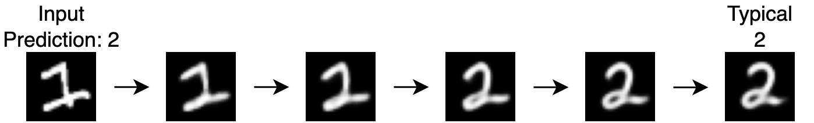

# An Image Classification Model Featuring Explainability by Image Morphing



LIME[1], SHAP[2], and Grad-CAM[3] have been widely used explanation methods for image classification.
These methods explain the reason for the model predictions by creating heatmaps on the input images.
However, these explanations only show us which areas the model used to make the prediction, and don't explain why the input image is classified into that class.
With such explanations, it is difficult to make us understand the model predictions, especially when it misclassified.

This model-specific method explains model predictions by using images that is generated by morphing the input image into a typical image of the predicted class.
By this explanation, we can understand that the input image can belong to the predicted class.
It makes us easier to understand model predictions than existing methods, especially when it misclassified.
Our method utilizes ID-CVAE[4] as the image classification model, which makes our method only needs single training session to perform both classification and explanation.

## Demo Repository

[quietsato/explanation-by-image-morphing-demo](https://github.com/quietsato/explanation-by-image-morphing-demo/)
([GitHub Pages](https://quietsato.github.io/explanation-by-image-morphing-demo))

## Method


## Train Models

```shell
python3 ./src/train.py
```

This script outputs logs and trained models to `out/train/[exec_start_time]`.

## Test Models

```shell
python3 ./src/main.py path/to/train_log
```

This script outputs explanation images to `out/main/[exec_start_time]`.
